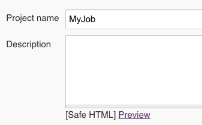

# OWASP Markup Formatter Plugin
## a.k.a. "Safe HTML" Formatter Plugin
## a.k.a. antisamy-markup-formatter-plugin

This plugin sanitizes HTML sources according to the
[OWASP AntiSamy MySpace sanitization policy](https://www.owasp.org/index.php/Category:OWASP_AntiSamy_Project) 
to allow limited HTML markup in user-submitted text.
It also prevents some sensitive Jenkins URLs from being emitted.

It is bundled in most default Jenkins installations.

The "Safe HTML" option in the "Global Security Configuration" page
of Jenkins CI is provided by this plugin. This is what controls
the HTML filtering for your job descriptions, etc.

The filter is not presently configurable or customisable without
writing a new extension to define a policy. The only filter available
for use is the
[`RawHtmlMarkupFormatter`](src/main/java/hudson/markup/RawHtmlMarkupFormatter.java),
which uses the [`MyspacePolicy`](src/main/java/hudson/markup/MyspacePolicy.java).

The facilities in this extension can be used to write formatters that use
custom policies. Model them on `RawHtmlMarkupFormatter` and `MyspacePolicy`.

## Configuration

This plugin is bundled in the Jenkins WAR file and will generally be
preinstalled.

When installed, 'Safe HTML' can be selected as Markup Formatter in
"Manage Jenkins" → "Configure Global Security" → "Markup Formatter":

{.confluence-embedded-image
.confluence-content-image-border}

User-submitted text will be sanitized by removing potentially dangerous
elements.

{.confluence-embedded-image
.confluence-content-image-border}

## Changing or altering the policy

At least in 1.5, the "Safe HTML" plugin has no support for editing,
overriding, or updating the HTML sanitization policy. A custom plugin
must be built instead. See `hudson.markup.RawHtmlMarkupFormatter.java` .

# See also:

* [Jenkins Plugin Wiki page](https://wiki.jenkins.io/pages/viewpage.action?pageId=71436291)
* [Jenkins Plugin Site page](https://plugins.jenkins.io/antisamy-markup-formatter)
* ["Managing Security" in Jenkins documentation](https://jenkins.io/doc/book/managing/security/)
